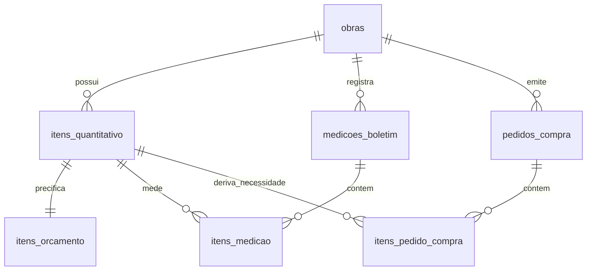

# 📋 Plano de Implementação: Módulos de Medições e Suprimentos no SQLite SSOT

Este plano descreve a evolução da arquitetura do sistema para incorporar **Medições Físico-Financeiras Relacionais** e **Requisições de Compras (BOM/UCC)** como entidades de primeira classe no banco central SQLite (`data/pmo_virtual.sqlite`), mantendo os princípios de **Fonte Única da Verdade**, segregação estrita entre geometria líquida e compras comerciais, e exportação automática em planilhas Excel com fórmulas dinâmicas.

---

## 🎯 Objetivos

1. **Persistência de Medições no SQLite:**
   - Permitir o registro, auditoria e histórico de múltiplos boletins de medição quinzenais/mensais (`Boletim 01`, `Boletim 02`, etc.) diretamente no banco relacional.
   - Calcular saldos e acumulados anteriores com integridade matemática garantida por consultas SQL.
   - Travar medições que tentem exceder 100% do quantitativo orçado sem aditivo contratual.
   - Alimentar dinamicamente a aba `06_BOLETIM_MEDICAO` do Excel com fórmulas e o Dashboard Next.js.

2. **Módulo de Requisições de Compra & Suprimentos (BOM / UCC) no SQLite:**
   - Estruturar os pedidos de compras e cotações respeitando a regra inegociável de **segregação**: o levantamento físico e o orçamento base continuam com a geometria líquida nominal de projeto.
   - O módulo de compras converte o insumo para a **Unidade Comercial de Compra (UCC)** (barras de 12m, sacos de 50kg, caixas, tubos de 6m) e aplica as **taxas de perda de referência** da `SKILL_GESTAO_08` / `POP 05`.
   - Rastreabilidade de status: `COTACAO`, `APROVADO`, `COMPRADO`, `ENTREGUE` e conferência com NF (`POP 06`).

3. **Integração Completa (Next.js + Exportadores + API):**
   - Rotas de API no Next.js (`/api/medicoes`, `/api/compras`).
   - Exportação automática de relatórios executivos em Excel com fórmulas.
   - Migração idempotente no SQLite (`schema_migrations` versão 2).

---

## 🏗️ Modelagem do Banco de Dados (Schema Migrations v2)

### 1. Tabelas de Medição Físico-Financeira
- **`medicoes_boletim`**:
  - `id INTEGER PRIMARY KEY`
  - `obra_id INTEGER NOT NULL REFERENCES obras(id)`
  - `numero_boletim INTEGER NOT NULL` (1, 2, 3...)
  - `periodo_inicio TEXT NOT NULL` (data ISO)
  - `periodo_fim TEXT NOT NULL` (data ISO)
  - `data_medicao TEXT NOT NULL`
  - `responsavel TEXT NOT NULL` (ex: "Eng. Alexandre")
  - `status TEXT NOT NULL CHECK(status IN ('EM_ELABORACAO','APROVADO','PAGO'))`
  - `observacao TEXT NOT NULL DEFAULT ''`
  - `created_at TEXT NOT NULL`
  - `UNIQUE(obra_id, numero_boletim)`

- **`itens_medicao`**:
  - `id INTEGER PRIMARY KEY`
  - `boletim_id INTEGER NOT NULL REFERENCES medicoes_boletim(id)`
  - `quantitativo_id INTEGER NOT NULL REFERENCES itens_quantitativo(id)`
  - `quantidade_periodo REAL NOT NULL CHECK(quantidade_periodo >= 0)`
  - `valor_periodo REAL NOT NULL CHECK(valor_periodo >= 0)`
  - `observacao TEXT NOT NULL DEFAULT ''`
  - `UNIQUE(boletim_id, quantitativo_id)`

### 2. Tabelas de Requisições de Compras & Suprimentos (UCC)
- **`pedidos_compra`**:
  - `id INTEGER PRIMARY KEY`
  - `obra_id INTEGER NOT NULL REFERENCES obras(id)`
  - `numero_pedido TEXT NOT NULL UNIQUE` (ex: `PC-ALPHA-2026-001`)
  - `data_pedido TEXT NOT NULL`
  - `fornecedor TEXT NOT NULL`
  - `status TEXT NOT NULL CHECK(status IN ('COTACAO','APROVADO','COMPRADO','ENTREGUE_PARCIAL','ENTREGUE_TOTAL','CANCELADO'))`
  - `condicao_pagamento TEXT NOT NULL DEFAULT ''`
  - `previsao_entrega TEXT NOT NULL DEFAULT ''`
  - `numero_nf TEXT NOT NULL DEFAULT ''`
  - `valor_total REAL NOT NULL DEFAULT 0`
  - `created_at TEXT NOT NULL`

- **`itens_pedido_compra`**:
  - `id INTEGER PRIMARY KEY`
  - `pedido_id INTEGER NOT NULL REFERENCES pedidos_compra(id)`
  - `quantitativo_id INTEGER REFERENCES itens_quantitativo(id)` (vínculo com o serviço gerador)
  - `codigo_sinapi TEXT NOT NULL DEFAULT ''`
  - `descricao_insumo TEXT NOT NULL`
  - `unidade_ucc TEXT NOT NULL` (saco 50kg, barra 12m, tubo 6m, m³, milheiro)
  - `fator_conversao REAL NOT NULL DEFAULT 1.0`
  - `taxa_perda_pct REAL NOT NULL DEFAULT 0.0`
  - `quantidade_liquida_projeto REAL NOT NULL DEFAULT 0.0`
  - `quantidade_ucc REAL NOT NULL` (quantidade comercial arredondada para cima)
  - `preco_unitario_negociado REAL NOT NULL DEFAULT 0.0`
  - `valor_total REAL NOT NULL DEFAULT 0.0`

---

## 🛠️ Arquitetura e Componentes a Desenvolver

### 1. Camada de Repositório (`scripts/motor_quantitativos/repositorio/`)
- [MODIFY] `sqlite_repository.py`:
  - Aplicar migração versão `2` com criação de índices e tabelas.
  - Adicionar funções de consulta e agregação:
    - `obter_acumulado_medicoes(db, obra_id, ate_boletim_id)`: calcula o acumulado anterior e saldos de cada serviço via SQL.
    - `salvar_boletim_medicao(db, obra_id, dados_boletim)`: valida se medição acumulada <= 100% do contratado e persiste.
    - `salvar_pedido_compra(db, obra_id, dados_pedido)`: persiste requisição de compras UCC.

### 2. Camada de Exportação Excel (`scripts/motor_quantitativos/exportadores/excel/`)
- [MODIFY] `sheet_medicao.py`:
  - Conectar a aba com o histórico real do SQLite (se houver boletins registrados no banco para a obra, lê o boletim selecionado; caso contrário, monta o template analítico inicial).
- [NEW] `sheet_compras.py`:
  - Exportador da Ordem de Compra / Requisição UCC em formato executivo com fórmulas de conversão e somatório.

### 3. API PMO Local (`scripts/api_pmo.py`)
- [MODIFY] `api_pmo.py`:
  - `GET /api/medicoes?obra_id={obra_id}`: lista histórico de boletins.
  - `POST /api/medicao/{obra_id}`: registra um novo boletim de medição física.
  - `GET /api/compras?obra_id={obra_id}`: lista ordens de compra e status.
  - `POST /api/compras/{obra_id}`: gera uma nova solicitação de compra UCC.

### 4. Dashboard Next.js (`apresentacao_comercial/`)
- [NEW] `src/app/api/medicoes/route.ts`: API route consultando `medicoes_boletim` e `itens_medicao` diretamente do SQLite.
- [NEW] `src/app/api/compras/route.ts`: API route consultando pedidos de compra no SQLite.
- [NEW] `src/app/dashboard/medicoes/page.tsx`: Interface visual para visualização do avanço físico, curva de avanço e saldos a executar.

---

## ⚠️ Regras de Ouro e Governança Inegociáveis

> [!IMPORTANT]
> **Blindagem de Geometria Líquida vs. UCC de Compras:**
> É terminantemente proibido retroalimentar o quantitativo de projeto com sobras de barras ou sacos comerciais de compras. `itens_quantitativo` continua estritamente líquido nominal.

> [!CAUTION]
> **Trava de Medição (A Regra da Trena - POP 09):**
> O sistema não aceitará avanço físico superior a 100% de qualquer serviço na EAP sem que haja uma revisão aprovada ou aditivo cadastrado no SQLite.

---

## 🧪 Plano de Verificação e Testes

1. **Testes Unitários Python:**
   - Adicionar casos em `scripts/tests/test_motor_quantitativos.py`:
     - Testar migração v2 do SQLite e criação das tabelas.
     - Testar inserção de boletim de medição e cálculo de acumulados e saldos.
     - Testar inserção de pedido de compras com conversão de UCC.
     - Testar recálculo do Excel mantendo fórmulas dinâmicas ativas.
2. **Validação do Build Next.js:**
   - `npx next build --webpack` garantindo 0 erros de compilação com as novas rotas.
