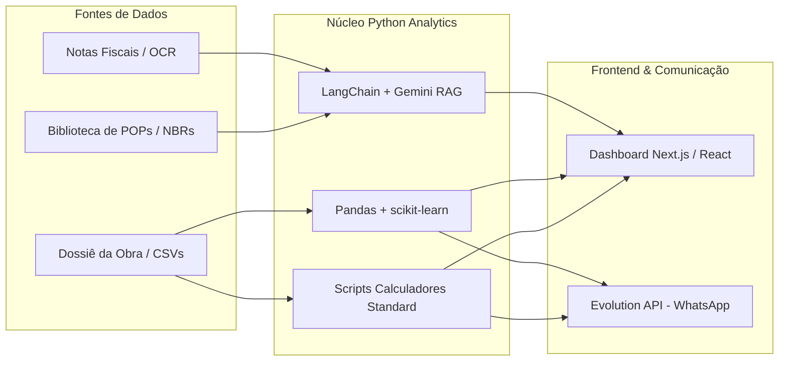

# 🛠️ MAPA DE FERRAMENTAS PYTHON: Automação, IA e Processamento de Dados

Este documento estabelece o guia oficial de arquitetura sobre as ferramentas de software e bibliotecas em Python aplicadas ao **Ecossistema de Gestão de Obras e PMO Virtual**. Ele detalha o que cada ferramenta faz, seu valor prático para a engenharia civil e como ela se integra ao nosso Roadmap 4.0.

---

## 📊 1. Matriz Resumida de Ferramentas

| Ferramenta / Biblioteca | Categoria | O que faz? | Necessidade no Projeto? | Status / Fase de Aplicação |
| :--- | :--- | :--- | :---: | :--- |
| **Pandas** | Processamento de Dados | Manipulação de tabelas, CSVs e relatórios complexos em alta velocidade. | **Essencial** 🟢 | Fase 2 (Orçamentos, EVM, Conciliação) |
| **LangChain / GenAI** | IA & RAG | Conecta LLMs (Gemini) a documentos locais (POPs, NBRs, Dossiê da Obra). | **Essencial** 🟢 | Fase 1B / 2 (Cérebro do PMO Virtual) |
| **scikit-learn** | Machine Learning | Algoritmos estatísticos para previsão de atrasos e custos passados. | **Recomendada** 🟡 | Fase 4 (Dashboards Preditivos) |
| **Streamlit** | Interface Web (Python) | Cria dashboards e calculadoras gráficas rapidamente em Python. | **Apoio Interno** 🟡 | Prototipagem de Calculadoras Internas |
| **Selenium / Playwright** | Web Scraping / Automação | Simula navegação em sites sem API (Prefeituras, SEFAZ, Fornecedores). | **Pontual** 🟠 | Sob Demanda (Busca de CNDs/Certidões) |
| **PyAutoGUI** | RPA Desktop | Simula cliques e digitação no mouse/teclado do computador. | **Evitar** 🔴 | Descartado (Incompatível com Nuvem/Headless) |
| **pdfplumber / Tesseract** | Visão & OCR | Extrai texto e dados de PDFs digitais e digitalizados (scans). | **Especializada** 🟢 | Fase 3A (OCR de Notas Fiscais e FVS) |

---

## 🔬 2. Detalhamento Técnico das Ferramentas

### 🐍 2.1. Pandas (Data Wrangling & Engenharia de Custos)
* **O que faz:** Permite carregar, filtrar, agrupar, cruzar e transformar grandes volumes de dados tabulares (CSV, Excel, SQL) com sintaxe extremamente eficiente.
* **Aplicação na Obra:**
  * **Conciliação 3 Pontas:** Cruzar Pedido de Compra $\times$ Nota Fiscal $\times$ Medição Física de Campo.
  * **Cálculos de EVM:** Processamento do Valor Planejado (VP), Valor Agregado (VA) e Custo Real (CR) para cálculo de SPI e CPI.
  * **Análise de RUP e Estoque:** Agrupamento do consumo diário de insumos (ex: sacos de cimento, kg de aço) x avanço físico dos diários de obra.

---

### 🧠 2.2. LangChain & Google GenAI SDK (Inteligência Artificial & RAG)
* **O que faz:** Estrutura o fluxo de trabalho de Inteligência Artificial Generativa. O LangChain permite realizar **RAG (Retrieval-Augmented Generation)**, fatiando documentos grandes em vetores para consulta semântica rápida.
* **Aplicação na Obra:**
  * **Assistente de POPs:** Permite ao PMO Virtual consultar a [Biblioteca de POPs](file:///c:/Users/Alexandre/Workspace/A11_SISTEMA_DE_GESTAO_OBRAS/procedimentos/) para responder dúvidas sobre procedimentos construtivos e conformidade PBQP-H.
  * **Auditoria do Dossiê:** Leitura de contratos de empreiteiros e memoriais descritivos para validar se uma medição solicitada cumpre o escopo contratado.

---

### 📈 2.3. scikit-learn (Machine Learning Preditivo)
* **O que faz:** Biblioteca de aprendizado de máquina contendo algoritmos de regressão, classificação, árvores de decisão e agrupamento.
* **Aplicação na Obra (Fase 4 do Roadmap):**
  * **Previsão de Término da Obra:** Treinamento de modelos com base nos RDOs históricos para prever a data real de entrega da obra com intervalo de confiança.
  * **Alerta de Overcost:** Identificação prévia de etapas com alta probabilidade de estouro financeiro baseada em oscilações de RUP de equipes passadas.

---

### 🎨 2.4. Streamlit (Interfaces Gráficas para Engenheiros)
* **O que faz:** Transforma scripts Python em web applications interativas em minutos, sem necessidade de escrever HTML, CSS ou JavaScript.
* **Aplicação na Obra:**
  * **Prototipagem:** Ferramenta ideal para engenheiros de estruturas ou orçamentistas testarem novas calculadoras (ex: dimensionamento rápido de formas ou simulador de traço de concreto) antes de integrar ao Dashboard principal em Next.js.

---

### 🌐 2.5. Selenium / Playwright (Robôs de Scraping Web)
* **O que faz:** Abre navegadores (Chrome/Firefox) em modo visível ou invisível (*headless*) para interagir com páginas web, clicar em botões e extrair dados.
* **Aplicação na Obra:**
  * **Certidões e Compliance:** Emissão automática diária ou semanal de Certidões Negativas de Débito (CND Municipal, Estadual e Federal) para pasta de documentação da empresa.
  * **Monitoramento de Preços:** Leitura automática de tabelas de preços de fornecedores locais que não possuem API.

---

### 📑 2.6. Visão Computacional e OCR (`pdfplumber` + `pytesseract` + `opencv`)
* **O que faz:** Converte documentos em formato PDF (vetoriais ou imagens escaneadas) em texto legível e dados estruturados.
* **Aplicação na Obra (Fase 3A):**
  * **Triagem de NFs:** Extração automática de número da nota fiscal, CNPJ do fornecedor, itens comprados e valor total a partir de PDFs recebidos no e-mail.
  * **Digitalização de FVS:** Leitura de Fichas de Verificação de Serviço preenchidas à mão no canteiro.

---

### 🛑 2.7. PyAutoGUI (Automação Desktop - Descartado)
* **O que faz:** Controla o cursor do mouse e envia pressionamentos de tecla no sistema operacional local.
* **Por que NÃO usar no Projeto:**
  * Exige que a máquina esteja ligada, desbloqueada e com a tela aberta.
  * Falha se a resolução da tela mudar ou se uma janela mover de lugar.
  * Impossível de executar em ambiente de nuvem (*Cloud/Docker/Serverless*).

---

## 🏗️ 3. Arquitetura de Integração no Ecossistema

O Python atua como o **motor analítico de backend**, comunicando-se com o ecossistema principal através de entradas/saídas estruturadas em CSV/JSON:

---

## 📅 4. Cronograma de Adição no `requirements.txt`

Atualmente, o projeto utiliza Python nativo sem dependências externas. As adições serão feitas conforme o progresso do projeto:

1. **Fase Atual:** Zero dependências (Python Standard Library - `json`, `math`, `datetime`, `argparse`).
2. **Fase 1B / 2:** Adição de `pandas` e `google-generativeai` / `langchain`.
3. **Fase 3A:** Adição de `pdfplumber`, `pytesseract` e `pillow`.
4. **Fase 4:** Adição de `scikit-learn` e `matplotlib` / `plotly`.

---

*Documento mantido pela Equipe de Arquitetura de Software e PMO Virtual.*
