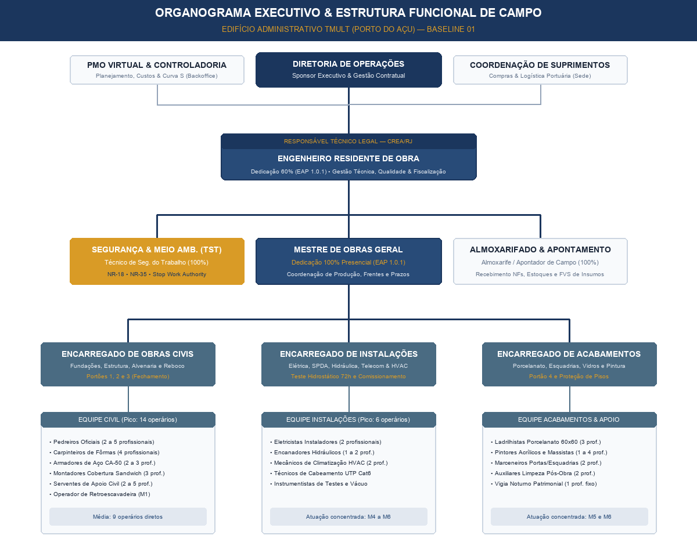
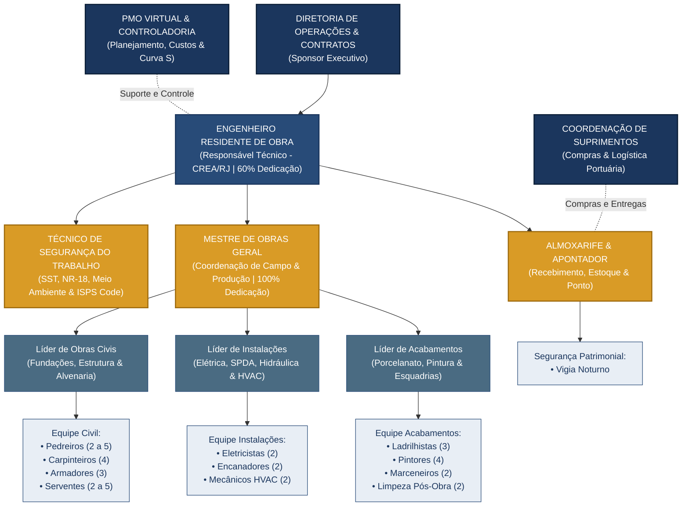

# 🏛️ ORGANOGRAMA FUNCIONAL & MATRIZ DE RESPONSABILIDADES (RACI)

**Empreendimento:** Edifício Administrativo do Terminal Multiuso (`OBRA_TMULT`) — Porto do Açu  
**Prazo Oficial:** 6 Meses (26 Semanas / 180 Dias Corridos)  
**Equipe Total:** 5 Fixos de Gestão/Apoio + Média de 12 a 15 Oficiais de Produção (Pico de 20 no Mês 3)  
**Data de Emissão:** 10/09/2026  
**Responsável Técnico:** PMO Virtual — Coordenação de RH, Governança e Operações  

---

## 1. Organograma Estrutural da Obra (Hierarquia de Campo & Sede)

A estrutura organizacional do empreendimento estabelece linhas de reporte claras, separando a **Estratégia/Retaguarda (Sede & PMO Virtual)**, a **Gestão Tática de Engenharia (Canteiro)** e a **Execução Operacional das Frentes de Serviço**:

### 1.1 Diagrama Visual Executivo


---

### 1.2 Estrutura em Blocos Visuais de Campo

```
┌─────────────────────────────────────────────────────────────────────────────┐
│                     DIRETORIA DE OPERAÇÕES & CONTRATOS                      │
│                            (Sponsor Executivo)                              │
└──────────────────────────────────────┬──────────────────────────────────────┘
                                       │
            ┌──────────────────────────┴──────────────────────────┐
            ▼                                                     ▼
┌───────────────────────────────┐             ┌───────────────────────────────┐
│  PMO VIRTUAL & CONTROLADORIA  │             │   COORDENAÇÃO DE SUPRIMENTOS  │
│(Planejamento, Custos & Curva S)│             │ (Compras & Logística Portuária│
└───────────────┬───────────────┘             └───────────────┬───────────────┘
                │   (Apoio & Controle)                        │ (Logística)
                └──────────────────────┬──────────────────────┘
                                       ▼
┌─────────────────────────────────────────────────────────────────────────────┐
│                        ENGENHEIRO RESIDENTE DE OBRA                         │
│             (Responsável Técnico Legal - CREA/RJ | 60% Dedicação)            │
└──────────────────────────────────────┬──────────────────────────────────────┘
                                       │
         ┌─────────────────────────────┼─────────────────────────────┐
         ▼                             ▼                             ▼
┌──────────────────┐         ┌──────────────────┐         ┌──────────────────┐
│  SEGURANÇA (TST) │         │ MESTRE DE OBRAS  │         │   ALMOXARIFADO   │
│  NR-18 e NR-35   │         │ (100% Presencial)│         │   & APONTAMENTO  │
│Stop Work Authorit│         │Coordenação Campo │         │Recebimento de NFs│
└──────────────────┘         └─────────┬────────┘         └────────┬─────────┘
                                       │                           │
         ┌─────────────────────────────┼────────────────┐          ▼
         ▼                             ▼                ▼   ┌───────────────┐
┌──────────────────┐         ┌──────────────────┐┌──────────┤ VIGIA NOTURNO │
│ ENCARREGADO CIVIL│         │  ENC. INSTALAÇÕES││ENC. ACABA│ Segurança     │
│Fundações/Estrutur│         │Elétrica/Hidr/HVAC││Porcelanat│ Patrimonial   │
└────────┬─────────┘         └─────────┬────────┘└────┬─────┘└───────────────┘
         │                             │              │
         ▼                             ▼              ▼
┌──────────────────┐         ┌──────────────────┐┌──────────────────┐
│   EQUIPE CIVIL   │         │EQUIPE INSTALAÇÕES││EQUIPE ACABAMENTOS│
│• 2 a 5 Pedreiros │         │• 2 Eletricistas  ││• 3 Ladrilhistas  │
│• 4 Carpinteiros  │         │• 2 Encanadores   ││• 4 Pintores      │
│• 3 Armadores     │         │• 2 Mecânicos HVAC││• 2 Marceneiros   │
│• 3 Montadores Cob│         │• Instrumentistas ││• 2 Limpeza Fina  │
│• 2 a 5 Serventes │         │                  ││                  │
└──────────────────┘         └──────────────────┘└──────────────────┘
```

---

### 1.3 Diagrama Mermaid Interativo



---

## 2. Descritivo de Papéis, Competências e Autoridade

### 2.1 Diretoria de Operações & Contratos (Sede)
* **Atribuições:** Representação institucional perante a Diretoria da Contratante (Porto do Açu / Prumo Logística), assinatura de aditivos contratuais, aprovação das medições financeiras e alocação de recursos corporativos.

### 2.2 PMO Virtual & Engenharia de Custos (Governança Central)
* **Atribuições:** Monitoramento semanal do avanço físico e financeiro (EVM - Earned Value Management), apuração dos índices SPI e CPI, cálculo determinístico do Caminho Crítico (CPM), simulação de cenários de aceleração (Crashing/Fast-Tracking) e governança da Linha de Base 01.

### 2.3 Engenheiro Residente de Obra (Responsável Técnico de Campo)
* **Dedicação:** 60% presencial em canteiro (EAP 1.0.1) com ART de Execução registrada no CREA/RJ.
* **Atribuições:** Gestão integral do canteiro, relacionamento técnico com a fiscalização do Porto do Açu, aprovação técnica das Fichas de Verificação de Serviço (FVS), validação dos ensaios laboratoriais de concreto/argamassa e emissão do RDO diário.
* **Autoridade:** Autoridade máxima técnica na obra para liberação de concretagens e assinatura de medições.

### 2.4 Mestre de Obras Geral (Comando Operacional)
* **Dedicação:** 100% presencial em tempo integral (EAP 1.0.1).
* **Atribuições:** Coordenação direta das equipes de produção própria e subempreiteiros, distribuição diária de tarefas na primeira hora da manhã, requisição de materiais ao almoxarifado com 48h de antecedência, fiscalização de prumo, nível, esquadro e espessuras.

### 2.5 Técnico de Segurança do Trabalho (TST)
* **Dedicação:** 100% presencial em canteiro (EAP 1.0.2).
* **Atribuições:** Aplicação dos programas de segurança (PGR, PCMSO e PGRCC), realização do Diálogo Diário de Segurança (DDS), inspeção diária de EPIs e EPCs, emissão de Permissões de Trabalho (PT) para altura (NR-35) e eletricidade (NR-10), integração de novos operários e interface com a segurança patrimonial portuária (ISPS Code).
* **Autoridade de Interrupção (Stop Work Authority):** O TST possui **autoridade total para paralisar imediatamente qualquer serviço** em caso de risco grave e iminente à integridade física dos trabalhadores.

### 2.6 Almoxarife & Apontador de Campo
* **Dedicação:** 100% presencial em canteiro (EAP 1.0.2).
* **Atribuições:** Conferência física e quantitativa de todas as notas fiscais na entrega (pesagem, conferência de lotes e pranchas), guarda segura de ferramentas elétricas e insumos de valor, controle de estoque mínimo de segurança e registro biométrico de presença da equipe.

---

## 3. Matriz de Responsabilidades RACI

A matriz RACI define o envolvimento de cada cargo nas principais entregas e marcos críticos do projeto:
* **R (Responsible / Responsável):** Quem executa a tarefa.
* **A (Accountable / Aprovador):** Quem responde pelo resultado e dá a aprovação final (apenas 1 por processo).
* **C (Consulted / Consultado):** Quem é consultado antes da tomada de decisão.
* **I (Informed / Informado):** Quem é notificado sobre o andamento e conclusão.

| Macroprocesso / Marco Executivo | Diretoria | PMO Virtual | Eng. Residente | Mestre de Obras | TST | Almoxarife | Fiscalização Contratante |
|---|:---:|:---:|:---:|:---:|:---:|:---:|:---:|
| **Aprovação do Orçamento & Linha de Base (Baseline 01)** | **A** | **R** | C | I | I | I | C |
| **Locação Topográfica & Abertura de Cavas** | I | I | **A** | **R** | C | I | C |
| **Portão 1: Liberação Impermeabilização Baldrame** | I | I | **A** | **R** | I | I | C |
| **Controle Tecnológico Concreto (Slump e Corpos de Prova)** | I | C | **A** | **R** | I | I | C |
| **Portão 2: Desforma Controlada Laje H12 (14 dias)** | I | C | **A** | **R** | C | I | C |
| **Execução Alvenaria & Cobertura Sandwich** | I | I | **A** | **R** | C | I | I |
| **Portão 3: Teste Hidrostático 72h em Redes Embutidas** | I | I | **A** | **R** | I | I | **A** |
| **Aplicação de Emboço Paulista Mecanizado** | I | I | **A** | **R** | C | I | I |
| **Portão 4: 1ª Demão de Pintura & Liberação Acabamentos** | I | I | **A** | **R** | I | I | I |
| **Instalação, Vácuo e Carga Frigorígena HVAC** | I | C | **A** | **R** | C | I | C |
| **Medição Mensal Físico-Financeira & RDO** | C | **R** | **A** | C | I | I | **A** |
| **Gestão de Resíduos da Construção (PGRCC)** | I | I | **A** | C | **R** | C | I |
| **Comissionamento Integrado & Start-up Sistemas** | C | C | **A** | **R** | C | I | **A** |
| **Emissão do Databook Técnico & TRP (Entrega)** | **A** | **R** | **R** | C | C | C | **A** |

---

## 4. Plano de Comunicação e Ritos de Gestão

Para garantir fluidez na tomada de decisão e eliminar gargalos executivos, a obra opera sob 4 ritos formais de governança:

1. **Rito Diário (Matinal - 07h00 às 07h20):**
   - *Participantes:* Mestre de Obras, TST e todos os operários.
   - *Pauta:* Diálogo Diário de Segurança (DDS de 10 min) + Distribuição física das frentes do dia (10 min).
2. **Rito Semanal de Alinhamento Tático (Toda Segunda-feira - 16h00 às 17h00):**
   - *Participantes:* Engenheiro Residente, Mestre de Obras, TST e Almoxarife.
   - *Pauta:* Avaliação do avanço físico da semana anterior, checagem do Caminho Crítico (CPM), liberação de materiais da semana com o Almoxarife e planejamento das inspeções de FVS.
3. **Reunião Semanal de Alinhamento com a Fiscalização (Toda Quarta-feira - 10h00):**
   - *Participantes:* Engenheiro Residente da Construtora e Fiscal de Obras do Porto do Açu.
   - *Pauta:* Vistoria de campo conjunta, avaliação de eventuais interferências ou RFIs em aberto e validação prévia das etapas do cronograma.
4. **Reunião Mensal de Resultados Executivos (Diretoria & PMO Virtual):**
   - *Participantes:* Diretoria de Operações, PMO Virtual e Engenheiro Residente.
   - *Pauta:* Fechamento da medição mensal, confrontação da Curva S (Planejado vs Realizado), análise de desvios de SPI/CPI e aprovação do faturamento.

---
*Organograma e Matriz RACI homologados pela Diretoria de Engenharia do PMO Virtual.*
